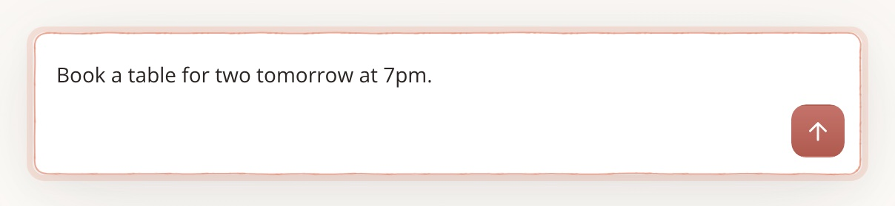
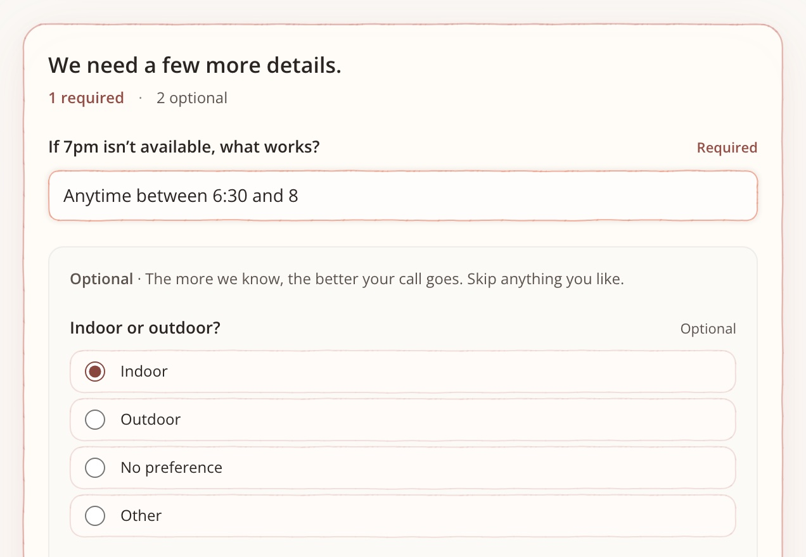
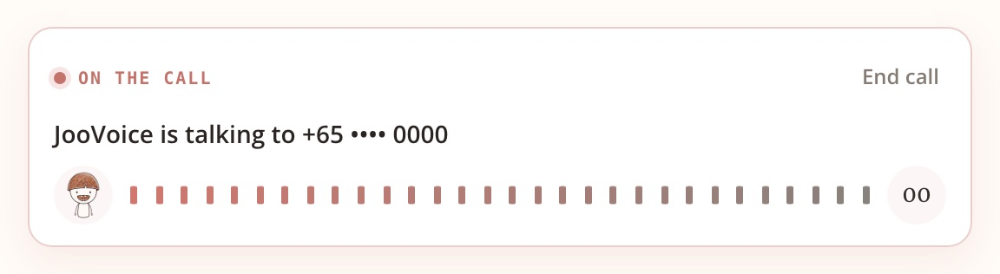
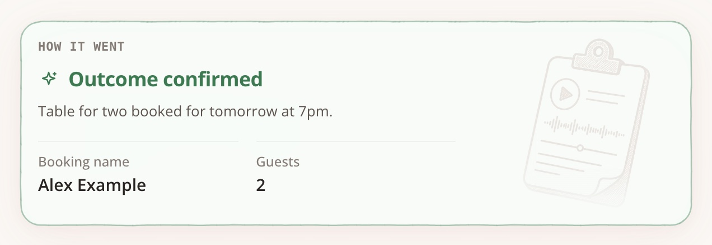

<p align="center">
  
</p>

<h3 align="center">Real phone calls, made for you.</h3>

<p align="center">
  
</p>

<p align="center">
  Tell your agent what you need. JooVoice makes the call. You get the result back in your chat.
</p>

<p align="center">
  <a href="https://joovoice.com">joovoice.com</a>
</p>

---

## What it calls for

Book a table. Move a doctor's or dentist's appointment. Cancel a subscription or a gym membership. Ask for a refund.
Get a late checkout. Change a booking or a flight. Check stock or opening hours. Call a friend on their birthday, or
check in on family. And more: anything you'd pick up the phone for.

JooVoice calls businesses and people. A personal call, like a birthday wish, goes through a link the person opens
first, so they're happy to take it.

## How it works

| You type. | We call. |
|---|---|
| **1. Say what you need** <br> In your own words: who to call, what for, and when. |  |
| **2. We ask what's missing** <br> Only what the other side will need, like what works if they're full. |  |
| **3. We make the call** <br> In the right language. Follow it while it runs. |  |
| **4. You get the result** <br> What happened, the details that matter, the recording and the transcript. |  |

The more detail you give (whose name it's under, a booking reference, what else works), the better the call goes.

## Install in Codex

```sh
codex plugin marketplace add JooCorp/joovoice-plugin
codex plugin add joovoice@joovoice
```

Codex opens JooVoice to sign in (or sign up). You approve the connection there and choose how calls are approved:

- **Let Codex decide (YOLO):** Codex goes ahead on its own, within a monthly limit you set.
- **In your chat:** Codex shows you each call and you say yes.
- **On JooVoice:** each call sends you a link to approve.

Then ask, for example: *"@JooVoice book a table for two at Mia this Friday at 7:30pm under my name. If it's full,
anything from 7 to 8:30 works."*

Using another agent? Connect it to JooVoice's MCP server directly: `https://app.joovoice.com/mcp`.

## What JooVoice won't do

- Impersonate you, or pass an identity or voice check as you.
- Cold calling or unsolicited sales outreach.
- Abusive requests.

## More

[joovoice.com](https://joovoice.com) · [Privacy](https://app.joovoice.com/privacy-policy) · [Terms](https://app.joovoice.com/terms-of-service)

<sub>This repository is published from JooVoice's own repository; changes are made there.</sub>
